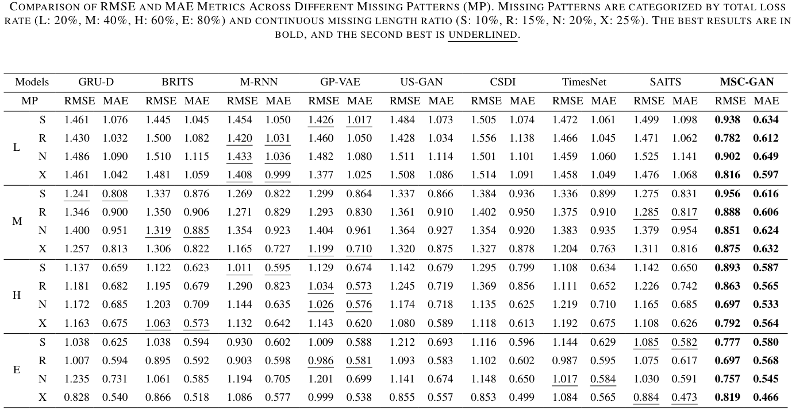
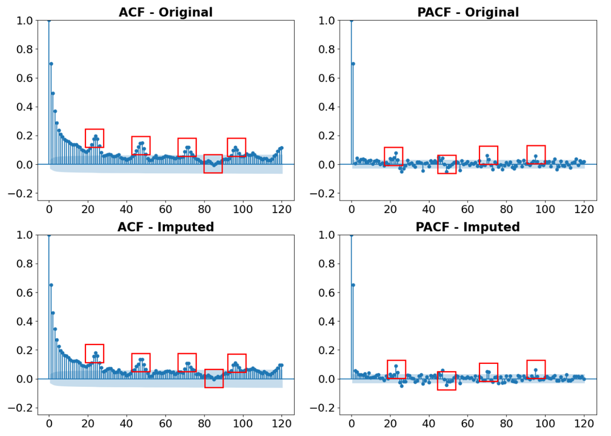

# MSC-GAN

Implementation of paper: 'Multi-Scale Conditional Generative Adversarial Networks for Wind Speed Data Imputation in Earthen Ruins Protection'

##  Abstract

Time-series data are crucial for earthen ruins' preservation, especially when assessing the impact of wind erosion. Harsh conditions at the site often shorten the life of sensors and result in significant gaps in monitored data. To address the issue of wind speed data imputation for earthen ruins monitoring, we present a Multi-Scale Conditional Generative Adversarial Network (MSC-GAN) utilizing a Transformer-based generator. Our model integrates features from multiple time scales—hourly, daily, and weekly—along with real-time wind direction data, original measurements, and random noise into the generator. Using the capabilities of the Transformer to capture long-range dependencies and model multi-scale features, MSC-GAN effectively manages complex missing data patterns. We validate our approach using nearly two years of near-surface wind speed data from the Suoyangcheng earthen ruins. Experimental results demonstrate that MSC-GAN significantly outperforms traditional methods, improving imputation accuracy by 40% for short continuous missing segments and 25% for long continuous missing segments. 

##  Highlights

1. We propose MSC-GAN, which utilizes cGAN for time series imputation.
2. We collected and organized a real-world wind speed dataset from earthen ruins preservation, characterized by repetition, anomalies, missing values, and fluctuating collection intervals.
3. We conducted a comparative evaluation using this dataset, demonstrating that our method outperforms other models in handling complex continuous data missing.

## Method

Fig.1 MSC-GAN Architecture.

Our approach customizes a multi-scale conditional generation logic based on the characteristics of the data to extract relevant feature vectors. We then merge the original data with this conditional information and embed it into a higher-dimensional space to uncover long-range dependencies and complex distributions for imputation. A multi-scale branch of the discriminator assesses the reliability of the imputed data, providing feedback to the generator in the form of loss for further refinement. Given the need to capture long-term sequential continuity, we use the Transformer architecture as the basis for the generator. 

## Main Results

Fig.2 Experimental result

Fig.3 Imputation Results (Left) and Model MAE under Missing Data Patterns (Right)

Fig.4 Seasonal decomposition of original and imputed data.The x-axis shows time, and the y-axis represents the seasonal component's magnitude.

Fig.5 ACF and PACF comparison of original and imputed data. The x-axis shows lags, and the y-axis displays correlation coefficients.

## Requirement

- python 3.9
- torch 1.13.1+cu116
- torchaudio 0.13.1+cu116
- torchvision 0.14.1+cu116
- pypots 0.7.1
- scikit-learn 1.5.1
- numpy 2.0.1
- pandas 2.2.2